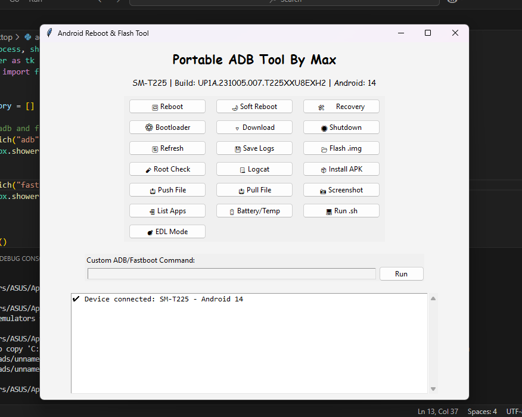

# Android Reboot & Flash Tool (adb.py)

## Description

This script provides a graphical interface to perform various ADB (Android Debug Bridge) and Fastboot operations on Android devices. It allows users to reboot into various modes, flash `.img` files, install APKs, transfer files, and more, without typing commands in the terminal.

---

## Features

- Reboot, Soft Reboot, Recovery, Bootloader, Download, and Shutdown
- Save logs to a file
- Flash `.img` files to fastboot partitions
- Root check (detect Magisk/SU)
- Live Logcat viewer
- Install APKs
- Push/Pull files to/from the device
- Take screenshot
- List user-installed apps
- Display battery and thermal info
- Run shell scripts on the device
- Reboot to EDL mode
- Run custom ADB/Fastboot commands

---

## Prerequisites

### 1. Install Python 3

Download and install Python from the official website:

[https://www.python.org/downloads/](https://www.python.org/downloads/)

During installation, make sure to check:

```
[✔] Add Python to PATH
```

You can verify the installation by running:

```bash
python --version
```

### 2. Install ADB & Fastboot

Download the Android Platform Tools from Google's official site:

[https://developer.android.com/studio/releases/platform-tools](https://developer.android.com/studio/releases/platform-tools)

Extract the ZIP file and copy the full path of the `platform-tools` directory (e.g., `C:\platform-tools`).

#### Add ADB to PATH (Windows)

1. Search for "Environment Variables" in the Start Menu.
2. Click "Environment Variables".
3. Under "System Variables", select the `Path` variable and click "Edit".
4. Click "New" and paste the path to your `platform-tools` folder.
5. Click OK to save and apply.

Verify by opening Command Prompt and running:

```bash
adb version
fastboot version
```

You should see version information if it's set correctly.

---

## How to Download and Use the Script

### Step 1: Download the Script

Save the file `adb.py` to any folder on your computer.

### Step 2: Run the Script

Open a terminal (Command Prompt, PowerShell, or Terminal), navigate to the folder where `adb.py` is saved, and run:

```bash
python adb.py
```

A GUI window will appear labeled **"Portable ADB Tool By Max"**.

Make sure your Android device is connected via USB with **USB Debugging** enabled.

---

## Using the GUI

Once the GUI opens, you will see various buttons categorized into functionalities. Click on any button to perform the corresponding action on the connected device. Use the "Custom ADB/Fastboot Command" field at the bottom to run manual commands.

To save logs or interact with fastboot/recovery/download mode, make sure the device is in the correct state and recognized by the system.

---

## Notes

- This tool is intended for use with only one device at a time.
- If multiple devices are detected, you will be prompted to enter the device ID.
- Use flashing or EDL mode responsibly, as improper usage may brick your device.
- This script is intended for Windows, but also works on Linux/macOS with minor modifications.

---

## License

This project is provided as-is without warranty. Use it at your own risk.
